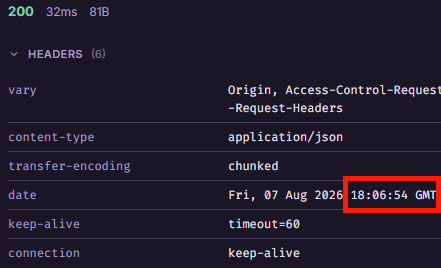
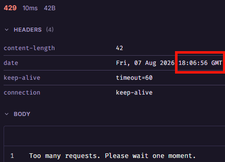
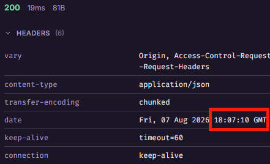

# Applicant Precheck Engine

   

A full-stack web application that takes user-submitted financial data (income and credit score) and returns a simple loan prequalification result. Built as a portfolio project to practice full-stack integration, automated testing, and backend request-handling security.

---

## Live Demo

Frontend (deployed):  
https://demo-applicant-precheck.vercel.app/

> ⚠️ Note: The backend runs on a free-tier host and may take 30–60 seconds to respond on the first request (cold start). Requests after that are fast.

---

## Tech Stack


**Frontend**
* React
* JavaScript/HTML5
* Bootstrap 5

**Backend**
* Java 21
* Spring Boot
* Maven
* H2 (in-memory database)

**Testing & Deployment**
* JUnit
* Bruno (API testing)
* Vercel (frontend) / Render (backend)

---

## Key Features

* **Decisioning logic:** Evaluates submitted income and credit score against a set of backend qualification rules and returns an Approved or Review status.
* **API rate limiting:** A backend filter using Bucket4j and a ConcurrentHashMap caps requests per IP, returning 429 Too Many Requests once a threshold is exceeded (e.g., an 11th rapid submission). Built to explore basic abuse-prevention patterns, not as a production-grade DoS defense.
* **Data Persistence:** Uses an H2 in-memory database to store application records for the lifetime of the running container. Data is not persisted across restarts, this was a deliberate scope choice for a demo project, not a production data layer.
* **Automated tests:** JUnit test suite covering the decisioning logic and rate-limiter behavior, run automatically on every build.
* **CORS & environment config:** Frontend and backend communicate via CORS configuration and environment variables, set up separately for local and deployed environments.

---

## API Security Walkthrough

### Normal traffic


### Rate limiter triggered on the 11th rapid request


### Request from a different IP allowed through


---

## How the Rate Limiter Works

This project includes a custom rate-limiting filter, built partly to learn how request IP handling works at a lower level before reaching for a library.

* **Proxy Chain Extraction (`X-Forwarded-For`):** The filter reads the `X-Forwarded-For` header and takes the first IP in the chain, so it doesn't accidentally rate-limit multiple users sharing one network/proxy.
* **IPv4-mapped IPv6 handling:** I read about a known rate-limiter bypass where a client exhausts its limit on an IPv4 address, then retries using the IPv4-mapped IPv6 form of the same address. The filter lowercases incoming IPs and strips the standard `::ffff:` prefix to catch this specific case.
* **Known limitation:** This normalization only handles the compressed `::ffff:` form and doesn't cover other IPv6 representations (e.g., uncompressed variants). I intentionally kept the scope narrow rather than writing a fuller parser. In a production setting, this logic should be replaced with a well-tested networking library rather than custom string handling.
* **Thread safety:** Each IP gets its own token bucket via Bucket4j, backed by a `ConcurrentHashMap`, so concurrent requests are handled safely.
* **Test coverage:** JUnit tests simulate proxied requests and the `::ffff:` bypass attempt to confirm the filter behaves as expected.

---

## Local Development Setup

### 1. Clone the repository

```bash
git clone https://github.com/sflugum/demo-applicant-precheck.git
cd demo-applicant-precheck
```

### 2. Backend Setup (Spring Boot)
Runs on port 8080. Requires Java 21.

```bash
cd loan-precheck-backend
./mvnw spring-boot:run
```

### 3. Frontend Setup (React)
Runs on port 3000. In a new terminal:

```bash
cd loan-precheck-frontend
npm install
```

Create a `.env` file in the frontend root directory:

```bash
REACT_APP_API_URL=http://localhost:8080
```

Start the app:

```bash
npm start
```
---

### 📖 Credits

- Favicon provided by Favicon.io
- Icons used are from Twemoji (Copyright 2020 Twitter, Inc and other contributors, licensed under CC-BY 4.0)
